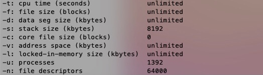

# 太宰治風の文章を生成するBot
青空文庫から太宰治の全作品を取り込み、マルコフ連鎖により新しい文章を生成します。

## 🍕 つまずいたところ
### [OSError:24] Too many open files
読み込む文章が多すぎて、OSエラーが出てしまった。
調べたところ、1プロセスが同時オープン可能なファイルディスクリプタ数の上限を超えてしまっていたことが原因らしい。ターミナル上で`ulimit -n`して現在の上限を確認したところ、結果は`256`でした。(標準の`1024`と比べてもかなり少ないぞ…。)
### 解決
やったこと①<br>
`$ ulimit -n 64000`を実行して、上限の変更を試みた。しかしこの変更の反映は一時的で、**rebootすると元の値に戻ってしまった。**
<br>
やったこと②<br>
ユーザごとのリソース制限を設定する`/etc/security/limits.conf`ファイルを変更した。
1. 仮想環境のターミナルで`$ sudo vi /etc/security/limits.conf`を実行
2. 編集モード「i」で以下のように記述
```console
root soft nofile 64000
root hard nofile 64000
```
3. `esc`でコマンドに切り替え、`:wq`で変更を保存

以上により、無事最大ファイルオープン数を変更できました。<br>
画像は`$ ulimit -a`で各種リソースの最大値を確認した結果です。`nofile`が64000になっているのが確認できます。

### 参考
- [ファイルディスクリプタ数の上限変更とlimits.confの罠(YUMELOG)](https://staffblog.yumemi.jp/ファイルディスクリプタ数の上限変更とlimits-confの罠-2/)
- [limits.confファイルにカーネルパラメタを設定する(Hitachi)](http://itdoc.hitachi.co.jp/manuals/3000/3000650130/HSYG0057.HTM)
